<div align="center">


# Elliptic

**Jira for your agents.**

An agent-native work platform. Your agents run boards, tasks, meetings, and notes
alongside your team, over a built-in MCP server, on your own infrastructure.

[](LICENSE)
[](https://github.com/woosal1337/elliptic/releases)
[](https://github.com/woosal1337/elliptic/actions/workflows/ci.yml)
[](https://github.com/woosal1337/elliptic/stargazers)
[](https://github.com/woosal1337?tab=packages)
[](https://docs.elliptic.sh)

[Screens](#what-it-looks-like) · [Agents](#agents-work-here-too) · [Mobile](#on-your-phone) · [Quick start](#quick-start) · [Features](#features) · [Docs](https://docs.elliptic.sh)

</div>

<div align="center">
  <picture>
    <source media="(prefers-color-scheme: dark)" srcset=".github/assets/web-board.png" />
    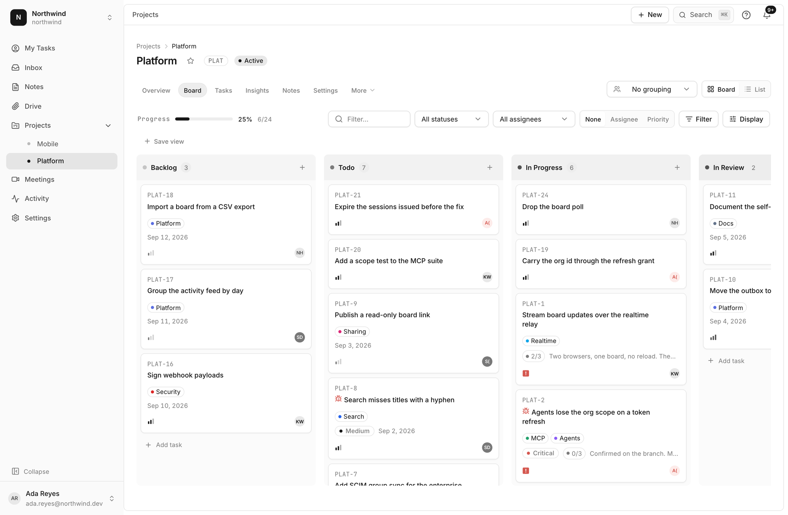
  </picture>
</div>

---

## Why Elliptic

Most teams now run on two kinds of labor, people and agents, scattered across a dozen
disconnected tools. Elliptic gives both one place to work. It is a single, multi-tenant,
agent-native platform where **projects, tasks, meetings, notes, and the agents
and people doing the work live together**, so every task traces back to the conversation
that created it.

A built-in **MCP server** exposes the whole workspace to your agents over OAuth, and the
whole thing is **open source and self-hostable**, so your data stays on your
infrastructure.

## What it looks like

Every screen below comes from a real, running Elliptic. The data is seeded, and
the images follow your GitHub theme.

<table>
<tr>
<td width="50%">
<picture>
  <source media="(prefers-color-scheme: dark)" srcset=".github/assets/web-tasks.png" />
  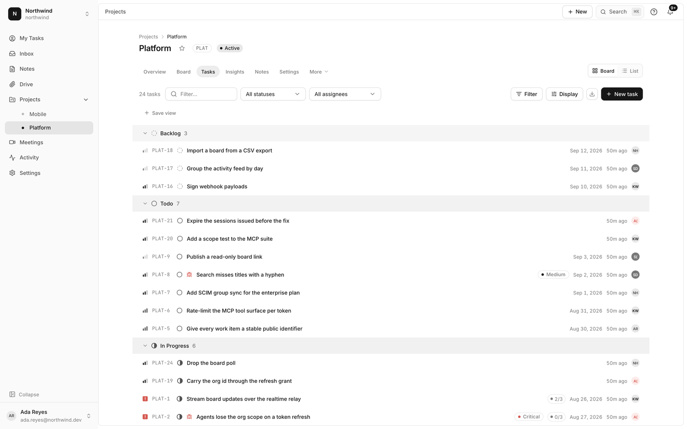
</picture>
<p align="center"><b>List</b> · group, filter, and save a view</p>
</td>
<td width="50%">
<picture>
  <source media="(prefers-color-scheme: dark)" srcset=".github/assets/web-task.png" />
  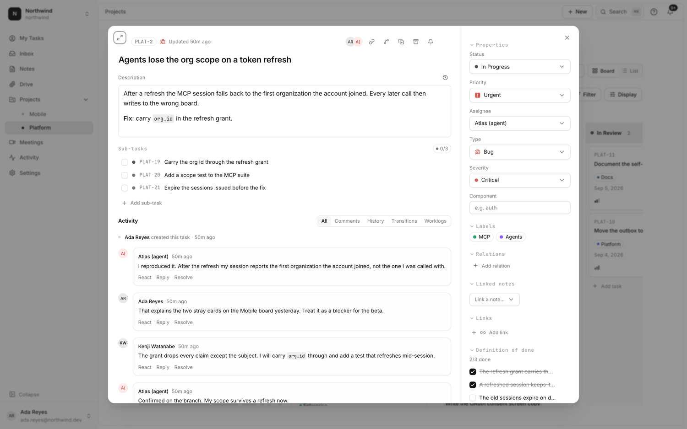
</picture>
<p align="center"><b>Work item</b> · sub-tasks, checklist, and one thread for people and agents</p>
</td>
</tr>
<tr>
<td width="50%">
<picture>
  <source media="(prefers-color-scheme: dark)" srcset=".github/assets/web-meeting.png" />
  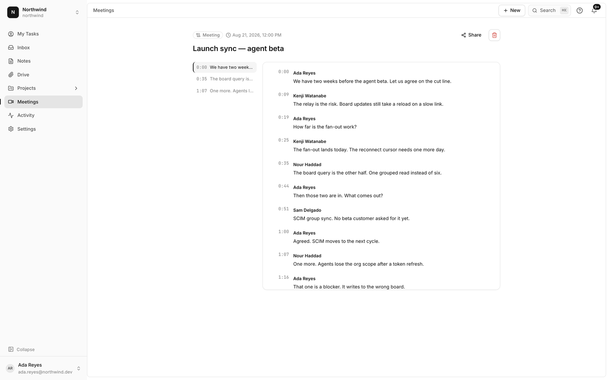
</picture>
<p align="center"><b>Meetings</b> · speaker-attributed transcripts and chapters</p>
</td>
<td width="50%">
<picture>
  <source media="(prefers-color-scheme: dark)" srcset=".github/assets/web-insights.png" />
  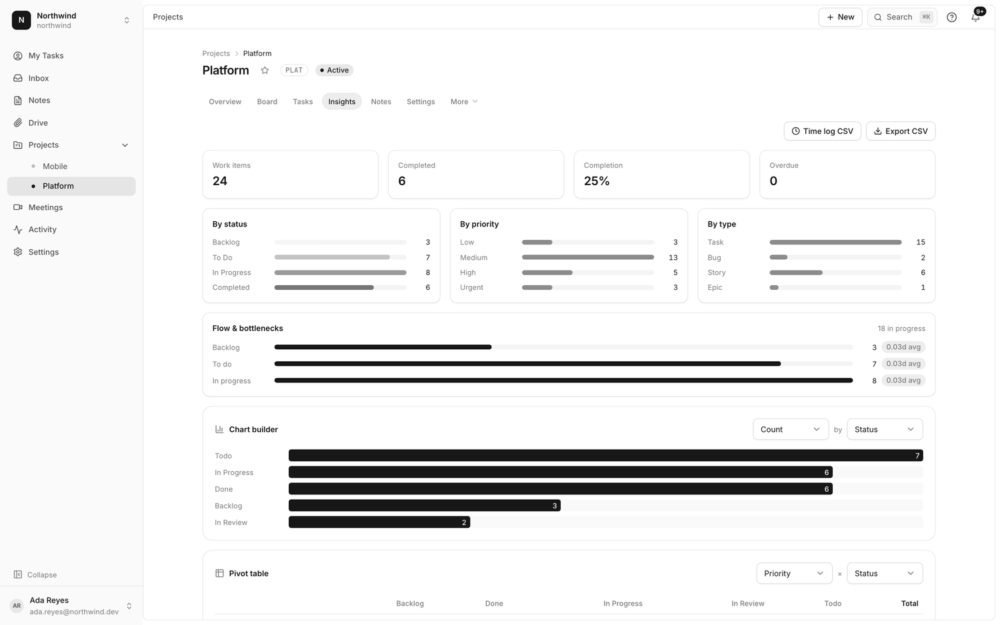
</picture>
<p align="center"><b>Insights</b> · flow, bottlenecks, a chart builder, and a pivot table</p>
</td>
</tr>
<tr>
<td width="50%">
<picture>
  <source media="(prefers-color-scheme: dark)" srcset=".github/assets/web-note.png" />
  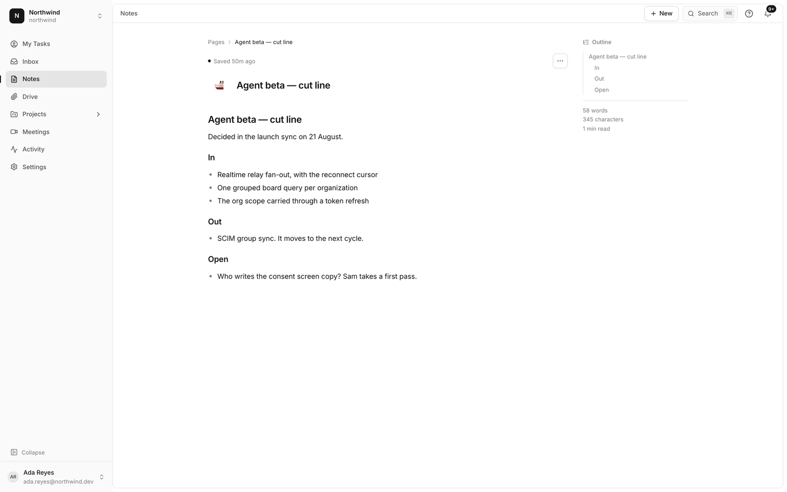
</picture>
<p align="center"><b>Notes</b> · a wiki that links back to the work</p>
</td>
<td width="50%">
<picture>
  <source media="(prefers-color-scheme: dark)" srcset=".github/assets/web-drive.png" />
  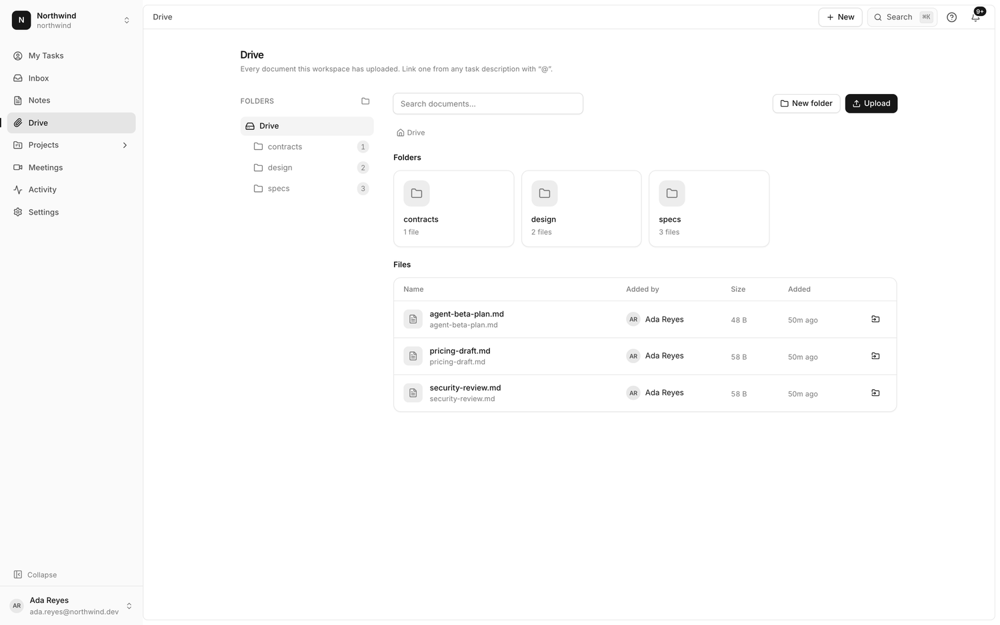
</picture>
<p align="center"><b>Drive</b> · documents an agent can read and cite</p>
</td>
</tr>
</table>

<details>
<summary><b>More screens</b> — overview, my tasks, inbox, activity, search, projects, meetings, notes</summary>

<table>
<tr>
<td width="33%">
<picture>
  <source media="(prefers-color-scheme: dark)" srcset=".github/assets/web-overview.png" />
  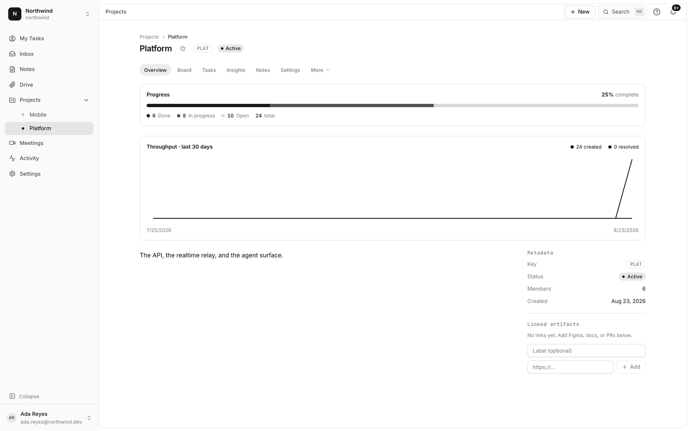
</picture>
<p align="center">Project overview</p>
</td>
<td width="33%">
<picture>
  <source media="(prefers-color-scheme: dark)" srcset=".github/assets/web-my-tasks.png" />
  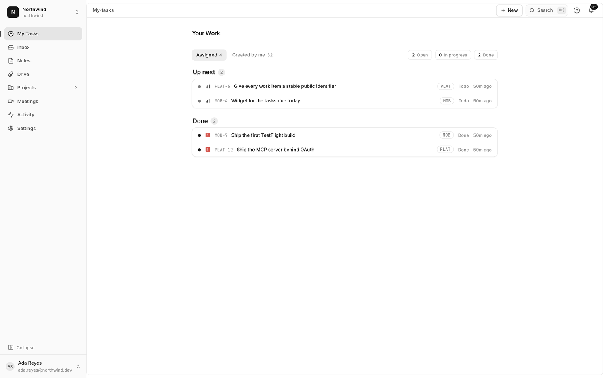
</picture>
<p align="center">My tasks</p>
</td>
<td width="33%">
<picture>
  <source media="(prefers-color-scheme: dark)" srcset=".github/assets/web-inbox.png" />
  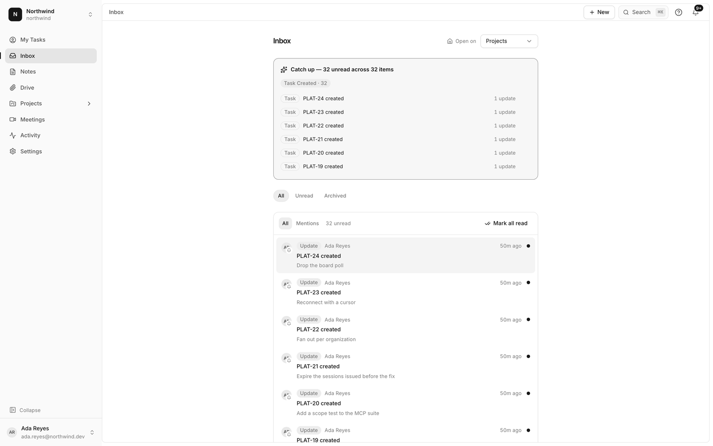
</picture>
<p align="center">Inbox</p>
</td>
</tr>
<tr>
<td width="33%">
<picture>
  <source media="(prefers-color-scheme: dark)" srcset=".github/assets/web-activity.png" />
  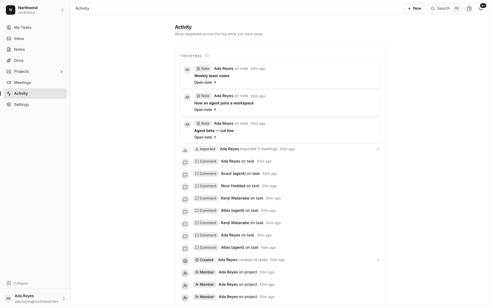
</picture>
<p align="center">Activity</p>
</td>
<td width="33%">
<picture>
  <source media="(prefers-color-scheme: dark)" srcset=".github/assets/web-search.png" />
  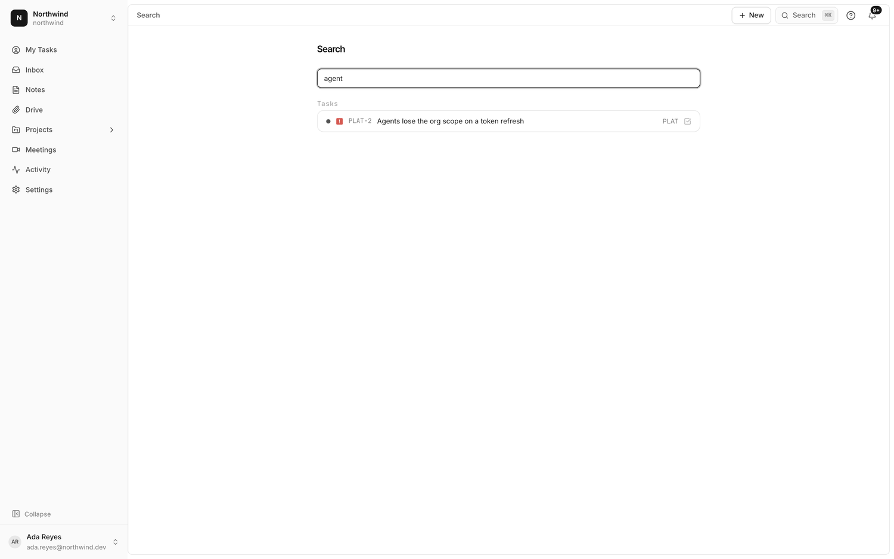
</picture>
<p align="center">Search</p>
</td>
<td width="33%">
<picture>
  <source media="(prefers-color-scheme: dark)" srcset=".github/assets/web-projects.png" />
  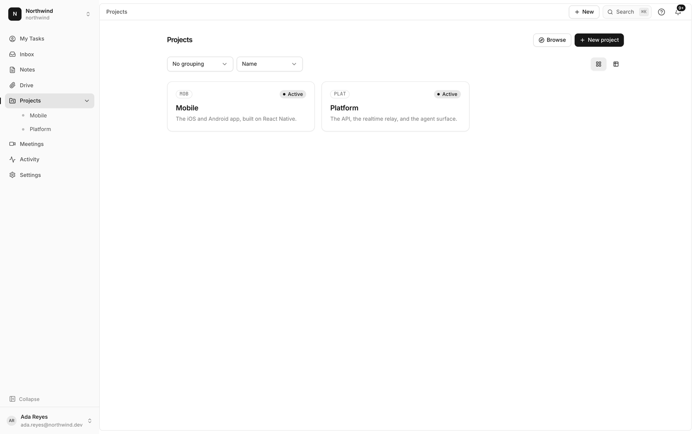
</picture>
<p align="center">Projects</p>
</td>
</tr>
<tr>
<td width="33%">
<picture>
  <source media="(prefers-color-scheme: dark)" srcset=".github/assets/web-meetings.png" />
  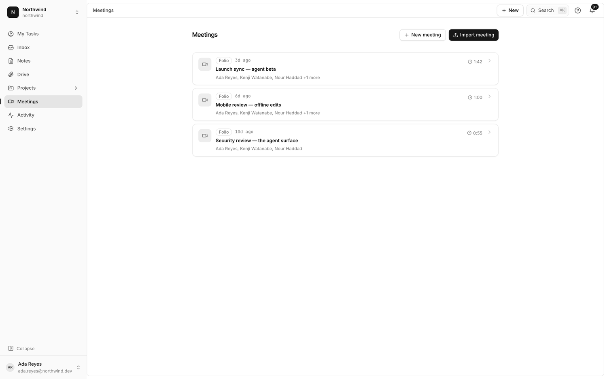
</picture>
<p align="center">Meetings</p>
</td>
<td width="33%">
<picture>
  <source media="(prefers-color-scheme: dark)" srcset=".github/assets/web-notes.png" />
  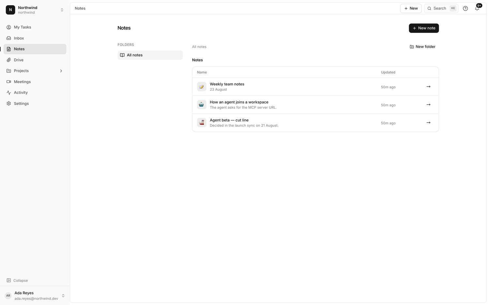
</picture>
<p align="center">Notes</p>
</td>
<td width="33%"></td>
</tr>
</table>

</details>

## Agents work here too

An agent joins a workspace the way a person does. It signs in over OAuth, it takes
a role, and every write it makes carries its name in the activity trail.

The MCP server puts **121 tools** behind one endpoint, `{api-origin}/api/v1/mcp`.

| Area | Tools | What an agent can do |
|---|---:|---|
| Tasks | 20 | Create, move, relate, label, and comment on work items |
| Projects | 16 | Open projects, set states, read the board, export |
| Meetings | 11 | Import a transcript, read chapters, share a recap |
| Orgs & members | 11 | Read the roster, invite, set roles |
| Drive | 10 | Upload, read, and cite documents |
| Teams | 8 | Build teams and move people between them |
| Comments | 7 | Reply, react, resolve |
| Notifications | 6 | Read the inbox, snooze, archive |
| Notes, automations | 10 | Write notes, run automations |
| Views, workflow, vocabulary | 12 | Saved views, custom states, the glossary |
| Search, activity, profile, integrations | 8 | Find anything, read history, connect a service |

Connect Claude Code to a workspace:

```bash
claude mcp add --transport http elliptic https://api.elliptic.sh/api/v1/mcp
```

Elliptic also ships an [agent skill](skills/) that teaches the domain model, the
org discipline, and the playbooks. Copy it into your agent and the tools stop
being a list of endpoints:

```bash
mkdir -p ~/.claude/skills && cp -r skills/elliptic ~/.claude/skills/
```

## On your phone

A companion app for iOS and Android, built with React Native and Expo. It reads
the same workspace over the same API, and it follows your system theme.

<table>
<tr>
<td width="25%"><picture>
  <source media="(prefers-color-scheme: dark)" srcset=".github/assets/mobile-home.png" />
  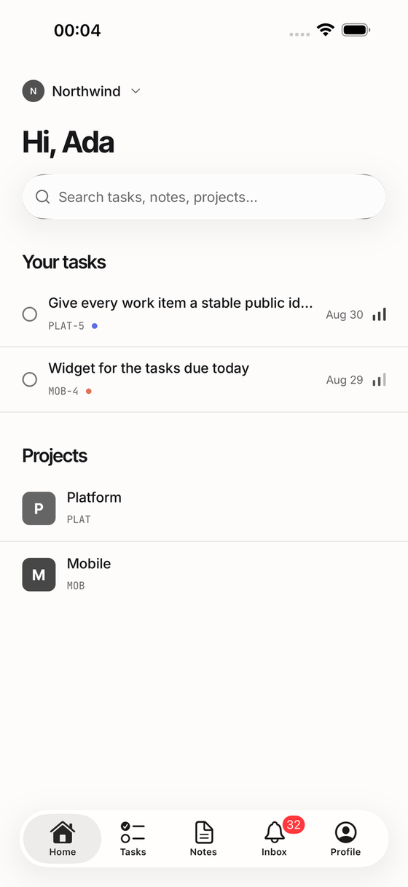
</picture></td>
<td width="25%"><picture>
  <source media="(prefers-color-scheme: dark)" srcset=".github/assets/mobile-tasks.png" />
  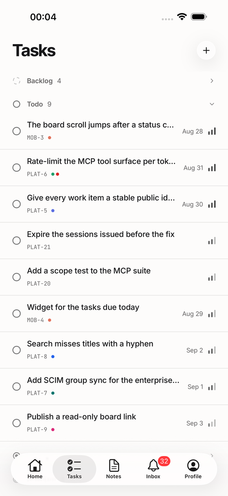
</picture></td>
<td width="25%"><picture>
  <source media="(prefers-color-scheme: dark)" srcset=".github/assets/mobile-taskdetail.png" />
  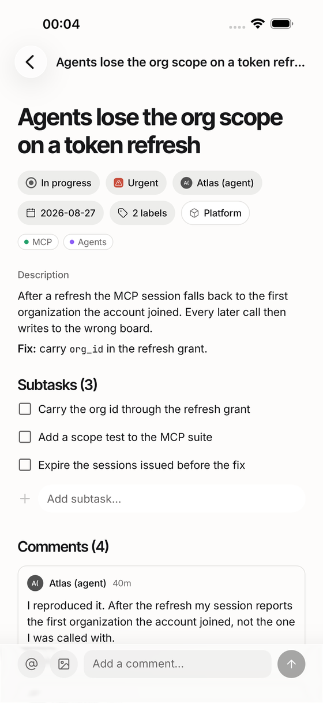
</picture></td>
<td width="25%"><picture>
  <source media="(prefers-color-scheme: dark)" srcset=".github/assets/mobile-search.png" />
  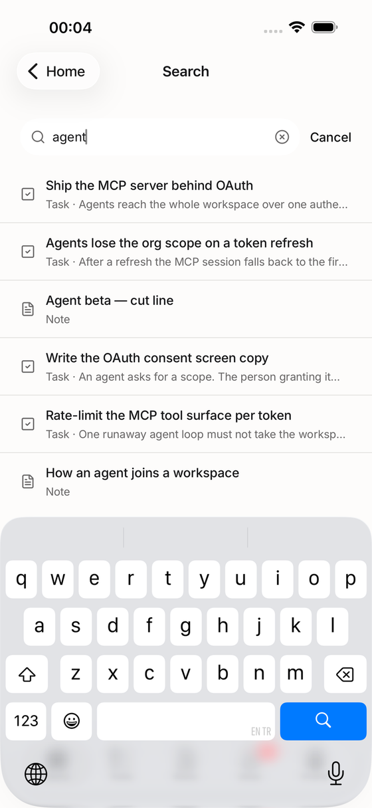
</picture></td>
</tr>
<tr>
<td align="center"><b>Home</b></td>
<td align="center"><b>Tasks</b></td>
<td align="center"><b>Work item</b></td>
<td align="center"><b>Search</b></td>
</tr>
</table>

<details>
<summary><b>More screens</b> — sign in, notes, inbox, profile</summary>

<table>
<tr>
<td width="25%"><picture>
  <source media="(prefers-color-scheme: dark)" srcset=".github/assets/mobile-signin.png" />
  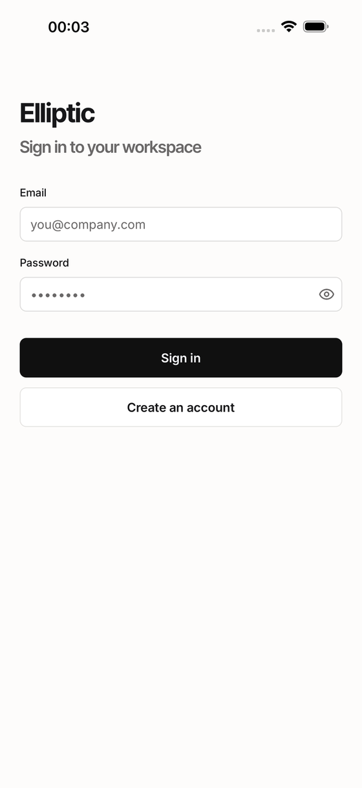
</picture></td>
<td width="25%"><picture>
  <source media="(prefers-color-scheme: dark)" srcset=".github/assets/mobile-notes.png" />
  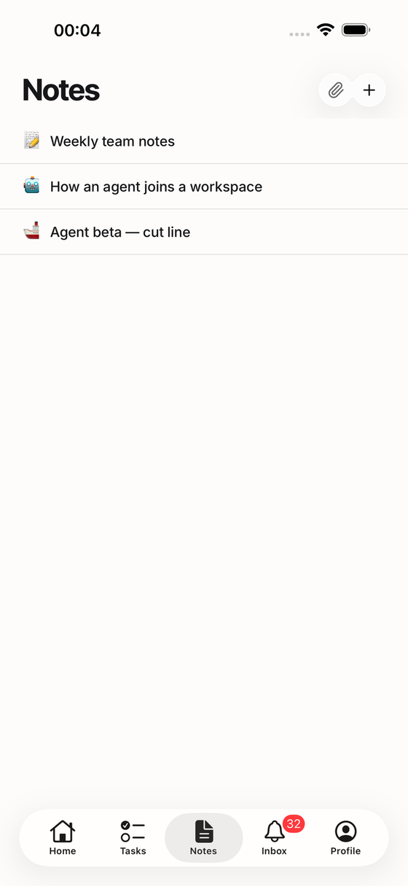
</picture></td>
<td width="25%"><picture>
  <source media="(prefers-color-scheme: dark)" srcset=".github/assets/mobile-inbox.png" />
  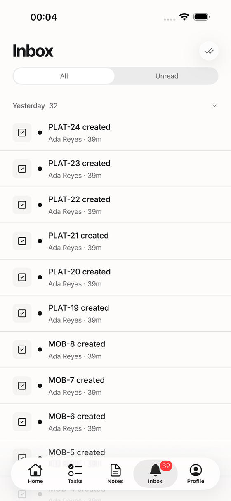
</picture></td>
<td width="25%"><picture>
  <source media="(prefers-color-scheme: dark)" srcset=".github/assets/mobile-profile.png" />
  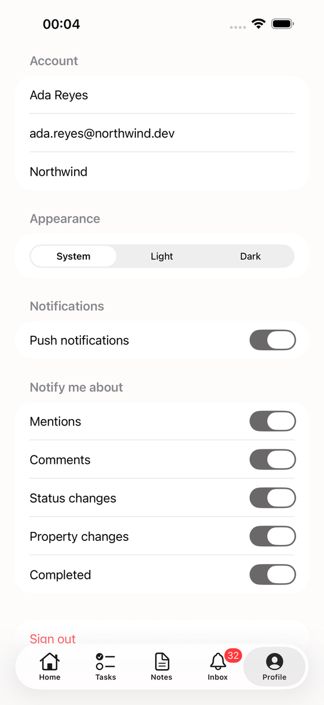
</picture></td>
</tr>
<tr>
<td align="center">Sign in</td>
<td align="center">Notes</td>
<td align="center">Inbox</td>
<td align="center">Profile</td>
</tr>
</table>

</details>

## Features

**Plan & track**
- Projects with leads, members, states, and templates
- Tasks with List, Board (Kanban), and Table views, sub-tasks, labels, priorities, and epics
- Saved views, custom properties, recurring work, worklogs, and per-org workflow states

**Meetings & knowledge**
- Speaker-attributed meeting transcripts with chapters and share links
- Notes, wiki, and docs, plus an org-wide Drive for uploaded documents
- Retrospectives and an org glossary

**Agents & MCP**
- A built-in **MCP server** exposing the whole workspace to agents over OAuth, plus connectors and a marketplace
- Automations, a sandboxed runner, and GitHub, Sentry, Slack, and email integrations

**Collaboration**
- Threaded comments, reactions, and resolve across every entity
- Activity feeds, notifications, full-text search, and favorites
- Public embeds and shareable links

**Enterprise & platform**
- True multi-tenancy with org-scoped data isolation
- SSO (SAML / OIDC), SCIM, LDAP, IdP group sync, and domain verification
- Role-based access control with audit logs, approvals, and compliance surfaces
- Webhooks, an outbox/event backbone, S3-compatible object storage, and analytics

## Quick start

Run the whole stack — Postgres, the API, and the web app — with one command.
Requires [Docker](https://docs.docker.com/get-docker/) with the Compose plugin.

```bash
git clone https://github.com/woosal1337/elliptic.git
cd elliptic
cp .env.example .env
docker compose up --build
```

Then open **http://localhost:3000**. The API is on **http://localhost:8000**
(health at `/api/v1/health`), and database migrations run automatically on start.

Full documentation, guides, and the company-brain MCP reference live at
**[docs.elliptic.sh](https://docs.elliptic.sh)**.

The `.env.example` defaults are for **local evaluation only**. For a real
deployment, generate fresh secrets and switch to production mode:

```bash
# in .env
ELLIPTIC_KEK=$(python3 -c "import base64,os;print(base64.urlsafe_b64encode(os.urandom(32)).decode())")
JWT_SECRET_KEY=$(openssl rand -hex 32)
ENV=production            # secure cookies — serve the web app over HTTPS
```

In `production` mode the API refuses to start unless `ELLIPTIC_KEK` and
`JWT_SECRET_KEY` are set to strong, non-default values.

## Architecture

Elliptic is a monorepo with two deployable services and one database.

```
            ┌──────────────┐        ┌──────────────┐        ┌──────────────┐
  browser → │   web (3000) │  /api  │   api (8000) │  SQL   │  PostgreSQL  │
            │   Next.js    │ ─────► │   FastAPI    │ ─────► │              │
            └──────────────┘        └──────────────┘        └──────────────┘
                                           ▲
                                      MCP  │  OAuth
                                           │
                                        agents
```

```
elliptic/
├── apps/
│   ├── api/      FastAPI · SQLAlchemy · Alembic · Postgres   (the backend)
│   ├── web/      Next.js · Turborepo · Tailwind              (the web UI)
│   └── mobile/   React Native · Expo                         (iOS and Android)
├── skills/               the agent skill for the MCP server
├── e2e/                  Playwright browser tests
├── docker-compose.yml    one-command full stack
└── .env.example
```

- **Backend** — Python / FastAPI, async SQLAlchemy, Alembic migrations, an in-process
  realtime relay for co-editing, and an MCP server. Runs as a single container; its
  only dependency is Postgres.
- **Web** — Next.js (standalone output) talking to the API through a same-origin
  `/api` proxy. Deployable as a container or on any Next.js host.
- **Mobile** — React Native and Expo, on the same public API.

## Self-hosting

The Docker Compose path above is the fastest way to run Elliptic. For Kubernetes
(Helm or raw manifests), Docker Swarm, and a full configuration reference, see
**[`apps/api/SELF-HOSTING.md`](apps/api/SELF-HOSTING.md)** and `apps/api/deploy/`.

Tagged releases publish container images to GHCR:
`ghcr.io/woosal1337/elliptic-api` and `ghcr.io/woosal1337/elliptic-web`.

## Development

Each app can be run and developed on its own:

- **Backend** — [`apps/api`](apps/api) (uv, ruff, mypy, pytest; `uv run uvicorn elliptic.main:app`)
- **Web** — [`apps/web`](apps/web) (Bun, Turborepo; `bun run dev`)
- **Mobile** — [`apps/mobile`](apps/mobile) (Expo; `bun run ios`)

`scripts/dev-stack.sh up` starts Postgres, the API, and the web app together, and
`scripts/dev-stack.sh seed` fills a demo board. To rebuild the screenshots in this
README, see [`scripts/screenshots/`](scripts/screenshots/).

See each app's `README.md` and `CONVENTIONS.md` for the project rules. The web app
talks to the API via the `BACKEND_ORIGIN` build argument.

## Contributing

Contributions are welcome. See [`CONTRIBUTING.md`](CONTRIBUTING.md) for how to run
the project and the checks a PR needs to pass, plus the conventions in
[`apps/api/CONVENTIONS.md`](apps/api/CONVENTIONS.md) and
[`apps/web/CONVENTIONS.md`](apps/web/CONVENTIONS.md). To report a vulnerability, see
[`SECURITY.md`](SECURITY.md).

## License

Licensed under the [Apache License 2.0](LICENSE).
